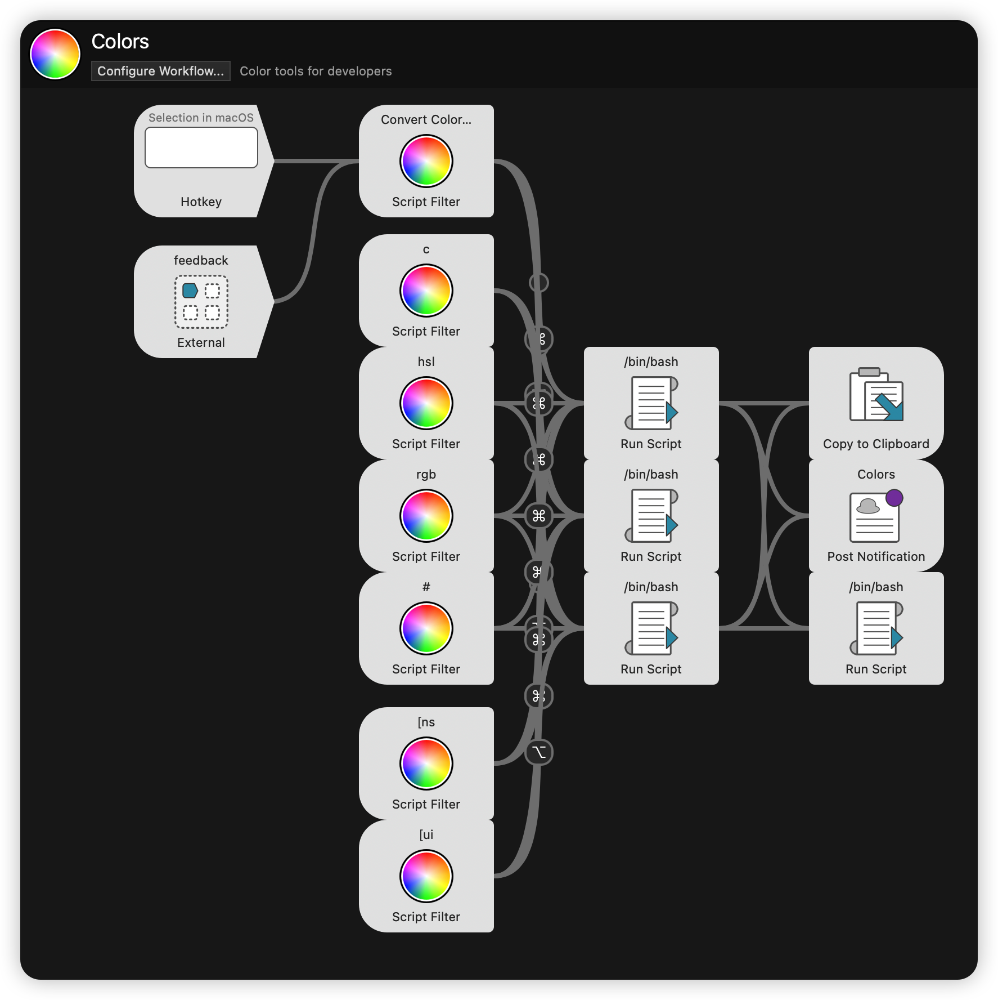
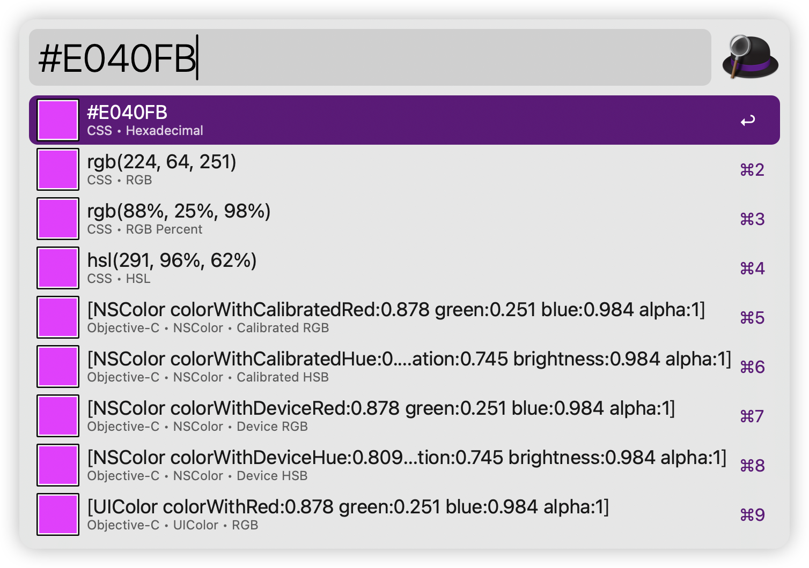
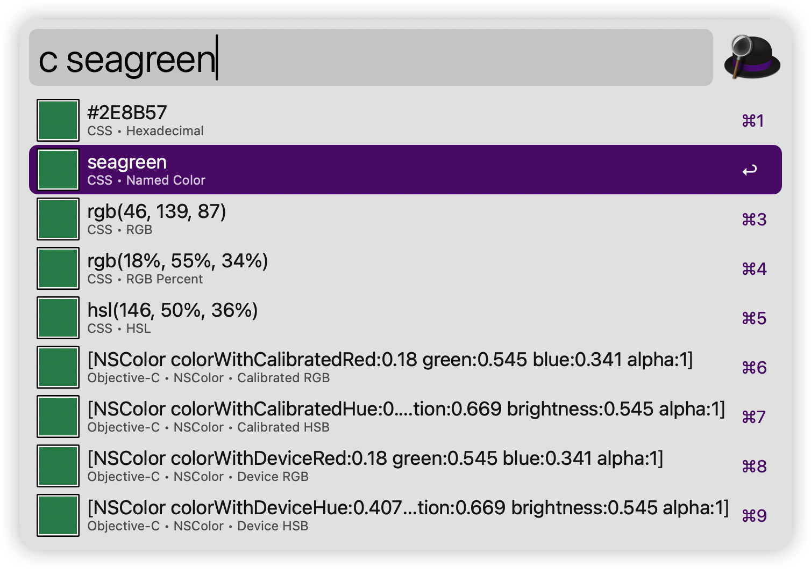
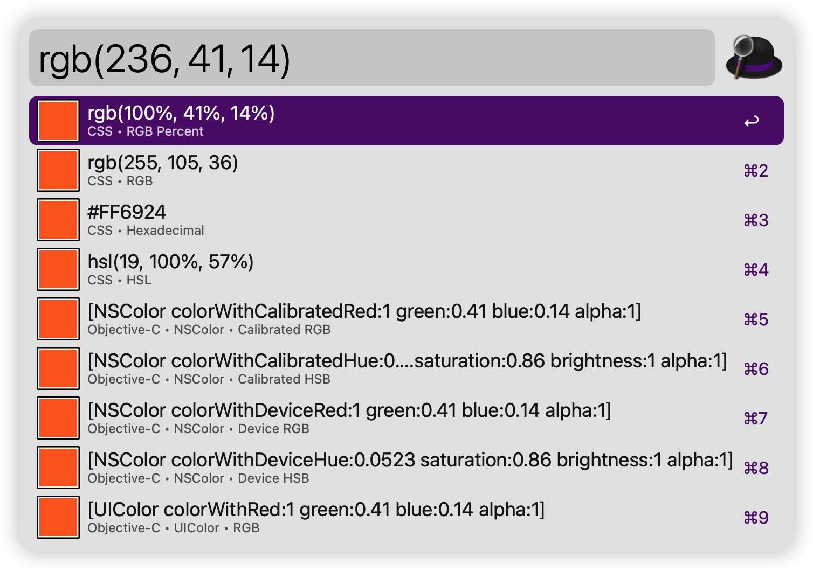
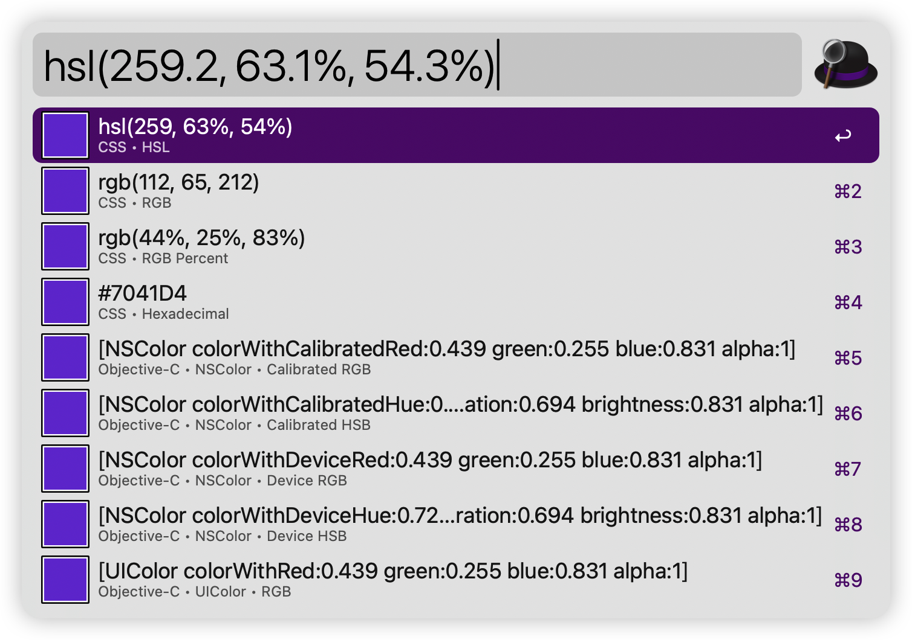

# Colors — Alfred Workflow

> **Original project:** [Tyler Eich / Alfred-Extras](https://github.com/TylerEich/Alfred-Extras)  
> **Copyright:** © 2013 Tyler Eich. All rights reserved.  
> **Modifications:** Cross-architecture (Intel + Apple Silicon) fixes applied by [kaikai-filu](https://github.com/kaikai-filu) using [Claude Code CLI](https://claude.com/claude-code) (powered by DeepSeek-V4).

---

## About

This is a color conversion workflow for [Alfred](https://www.alfredapp.com/). It converts between hex, RGB, HSL, NSColor, UIColor, Swift Color, and 148 CSS named colors — all from the Alfred launcher.

> 📖 [中文版 (Chinese README)](./README_CN.md)

The original workflow, created by **Tyler Eich** in 2013 (before the Apple Silicon era), contained x86_64-only binaries that produce `Bad CPU type in executable` on modern Macs with Apple M-series processors. This fork rebuilds the binaries as **universal (x86_64 + arm64)**, fixes several bugs uncovered during modern compilation, and makes the project buildable from source.

## Keywords

| Keyword | Input format        | Example                                          |
|---------|---------------------|--------------------------------------------------|
| `c`     | CSS named color     | `c red`                                          |
| `#`     | Hex color           | `#ff0000`                                        |
| `rgb`   | CSS RGB             | `rgb(255, 0, 0)`                                 |
| `hsl`   | CSS HSL             | `hsl(180, 100%, 50%)`                             |
| `[ns`   | NSColor (ObjC)      | `[ns colorWithRed:1 green:0 blue:0 alpha:1]`     |
| `[ui`   | UIColor (ObjC)      | `[ui colorWithRed:1 green:0 blue:0 alpha:1]`     |

> **Note:** Swift syntax (`NSColor(…)` / `UIColor(…)`) is supported as typed input after the `[ns` / `[ui` keyword is active — they share the same Script Filter trigger and parser.

### Output formats

CSS Hex, CSS RGBA, CSS RGB%, CSS HSLA, CSS Named, 32-Bit Hex, NSColor (calibrated/device RGB, HSB, White), UIColor (RGB, HSB, White), Swift NSColor, Swift UIColor.

### Modifier keys

| Key     | Action                          |
|---------|---------------------------------|
| ⌥ Option | Toggle alpha channel, then copy |
| ⌘ Command | Reveal in macOS color panel    |

## Screenshots

### Workflow overview



### Keyword: `#` (Hex color)



### Keyword: `c` (CSS named color)



### Keyword: `rgb` (CSS RGB)



### Keyword: `hsl` (CSS HSL)



### Keyword: `[ns` (NSColor)

| ObjC syntax | Swift syntax |
|-------------|--------------|
|  |  |

### Keyword: `[ui` (UIColor)

| ObjC syntax | Swift syntax |
|-------------|--------------|
|  |  |

## Changes from the original

The original workflow (v2.0.0) was built in 2013 for Intel Macs only. This version:

- **Rebuilds both binaries** (`colors` and `Colors.app`) as **universal Mach-O** (x86_64 + arm64)
- **Fixes 4 bugs** discovered during modern compilation:

  1. **Missing ObjC memory attributes** — `@property` declarations in `AWFeedbackItem.h` lacked `(copy)`/`(strong)`, defaulting to unsafe `assign` and causing dangling pointer crashes.
  2. **Uninitialized variable** — `NSString *av` in `AWFeedbackItem.m:125` was not nil-initialized, causing random pointer dereference in XML generation.
  3. **Missing memory attributes** — `AWWorkflow.h` and `AWPreferences.h` had the same issue as #1.
  4. **Nil format crash** — `preferredFormatForKey:` in `colors.m` did not guard against nil `format` for non-`ns` keys.

- **Adds `build.sh`** for reproducible compilation from source
- **Minimum deployment target**: macOS 10.13

## Build

```bash
./build.sh
```

Requires Xcode Command Line Tools. Produces `Colors.alfredworkflow`.

## Project structure

```
Colors/
├── Colors.alfredworkflow   ← Final workflow package
├── build.sh                ← Build script
├── README.md
├── README_CN.md
└── src/
    ├── colors/
    │   ├── Alfred/         ← Alfred framework (8 headers + 8 implementations)
    │   └── colors/         ← colors CLI (colors.h, colors.m, main.m)
    └── ColorsApp/          ← macOS color picker app (5 files)
```

## Credits & Contributors

| Role | Name | Contact |
|------|------|---------|
| **Original author** | **Tyler Eich** | [GitHub](https://github.com/TylerEich) · eichtyler@gmail.com |
| **Modifications & maintenance** | **kaikai-filu** | [GitHub](https://github.com/kaikai-filu) |
| **AI-assisted development** | **Claude Code** (Anthropic) | Powered by DeepSeek-V4 |

This project is not endorsed by or affiliated with the original author. The original source code is available at [TylerEich/Alfred-Extras](https://github.com/TylerEich/Alfred-Extras).

## License

See the original repository for license information.
